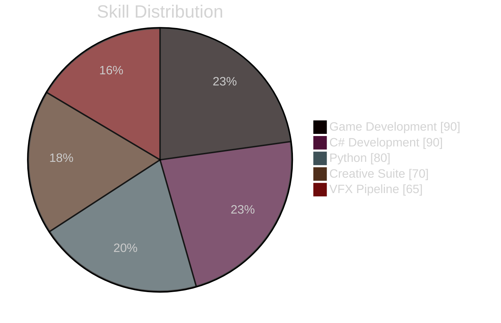

<div align="center">
  
  <!-- 다중 애니메이션 배너 - 더 화려한 텍스트 추가 -->
  

  <!-- 3D 텍스트 배너 추가 -->
  <a href="https://github.com/your-username">
    
  </a>
</div>

<div align="center">
  <!-- 커스텀 웨이브 헤더 -->
  
</div>

<!-- 프로필 뷰 카운터 + 소셜 뱃지 (홀로그램 효과 추가) -->
<div align="center">
  
  <a href="https://github.com/your-username?tab=followers">
    
  </a>
  
</div>

<br>

<!-- 디자인 구분선 추가 -->


<!-- 확장된 기술 스택 섹션 - 3D 효과 추가 -->
<div align="center">
  
</div>

<div align="center">
  <!-- 3D 아이콘 스택 추가 -->
  
  
  <!-- 개발 도구 뱃지 - 그라데이션 효과 -->
  <div style="margin: 20px 0;">
    
    
    
    
  </div>
</div>

<!-- 스킬 진행바 (네온 효과 추가) -->
<div align="center">
  <h3>💫 Mastery Levels</h3>
  


```text
🎮 Game Development    ██████████████████████░░  90% ⭐
🔧 C# Development     ██████████████████████░░  90% ⭐
🐍 Python             ████████████████████░░░░  80% 🌟
🎨 Creative Suite     ████████████████░░░░░░░░  70% ✨
🚀 VFX Pipeline      ███████████████░░░░░░░░░  65% 💫
```
</div>

<!-- 새로운 섹션: 현재 작업 중인 프로젝트 -->
<div align="center">
  
</div>

<table align="center">
<tr>
<td width="50%">
<h3 align="center">🎮 Game Project</h3>
<div align="center">
  <a href="github.com/your-username/game-project" target="_blank">
    
  </a>
  <p><strong>Unity-based Adventure Game</strong></p>
  <p>A revolutionary gaming experience with advanced AI</p>
</div>
</td>
<td width="50%">
<h3 align="center">🤖 AI Project</h3>
<div align="center">
  <a href="github.com/your-username/ai-project" target="_blank">
    
  </a>
  <p><strong>AI-Powered Tool</strong></p>
  <p>Revolutionizing development workflow</p>
</div>
</td>
</tr>
</table>

<!-- GitHub 통계 (홀로그램 스타일) -->
<div align="center">
  
  
   
  
</div>

<!-- 새로운 섹션: 작업 환경 -->
<div align="center">
  
  
  ```text
  🖥️ Windows 11 Pro | MacBook Pro M1
  💾 32GB RAM | 2TB SSD
  🎨 4K Display Setup
  🎧 Premium Audio System
  ```
</div>

<!-- 연락처 섹션 (홀로그램 스타일) -->
<div align="center">
  
  
  <a href="mailto:your.email@gmail.com">
    
  </a>
  <a href="https://www.linkedin.com/in/your-profile/">
    
  </a>
  <a href="https://discord.gg/your-server">
    
  </a>
</div>

<!-- 스네이크 애니메이션 (네온 효과) -->
<div align="center">
  <picture>
    <source media="(prefers-color-scheme: dark)" srcset="https://raw.githubusercontent.com/your-username/your-username/output/github-contribution-grid-snake-dark.svg">
    <source media="(prefers-color-scheme: light)" srcset="https://raw.githubusercontent.com/your-username/your-username/output/github-contribution-grid-snake.svg">
    
  </picture>
</div>

<!-- 애니메이션 푸터 (홀로그램 효과) -->
<div align="center">
  
</div>
